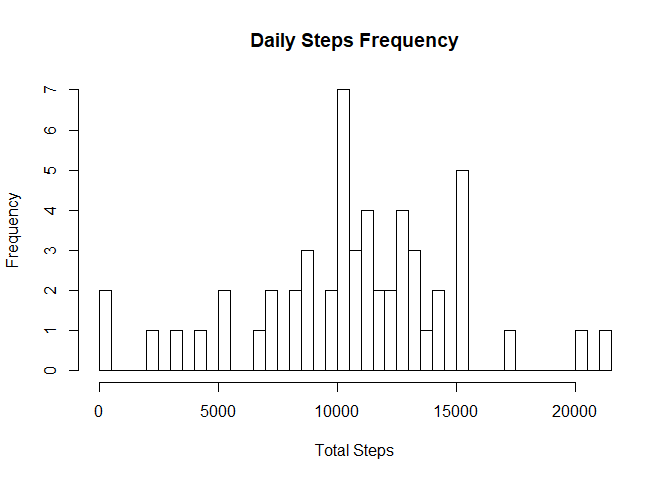
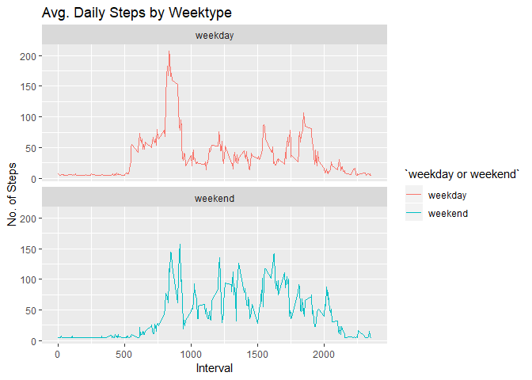

## Loading and preprocessing the data
* Set the environment


```r
#Test Scripts
##Solution Environment
library(dplyr)
```

```
## 
## Attaching package: 'dplyr'
```

```
## The following objects are masked from 'package:stats':
## 
##     filter, lag
```

```
## The following objects are masked from 'package:base':
## 
##     intersect, setdiff, setequal, union
```

```r
library(data.table)
```

```
## 
## Attaching package: 'data.table'
```

```
## The following objects are masked from 'package:dplyr':
## 
##     between, first, last
```

```r
library(lubridate)
```

```
## 
## Attaching package: 'lubridate'
```

```
## The following objects are masked from 'package:data.table':
## 
##     hour, isoweek, mday, minute, month, quarter, second, wday,
##     week, yday, year
```

```
## The following object is masked from 'package:base':
## 
##     date
```

```r
library(ggplot2)
```

1. Extract dataset as Data Table


```r
mad <- fread("activity/activity.csv")
```

## What is mean total number of steps taken per day?

2. Calculate the total number of steps taken per day

```r
by_date <- group_by(mad, date)
madTotalSteps <- summarise(by_date, totStepsPerDay = sum(steps, na.rm = FALSE))
```

3. Make a histogram of the total number of steps taken each day


```r
hist(madTotalSteps$totStepsPerDay, main="Daily Steps Frequency", xlab="Total Steps", breaks=nrow(madTotalSteps))
```

<!-- -->

4. Calculate and report the mean and median of the total number of steps taken per day


```r
madMeanSteps <- summarise(by_date, meanSteps = mean(steps, na.rm = TRUE))
madMedSteps <- summarise(by_date, medSteps = median(steps, na.rm = TRUE))
```

## What is the average daily activity pattern?

* Make a time series plot (i.e.l) of the 5-minute interval (x-axis) and the average number of steps taken, averaged across all days (y-axis)


```r
by_int <- group_by(mad, interval)
madMeanIntSteps <- summarise(by_int, intMeanSteps = mean(steps, na.rm=TRUE))

ggplot(madMeanIntSteps, aes(x = interval , y = intMeanSteps)) + geom_line(color="blue", size=1) + labs(title = "Avg. Daily Steps", x = "Interval", y = "Avg. Steps per day")
```

<!-- -->

* Which 5-minute interval, on average across all the days in the dataset, contains the maximum number of steps?

```r
maxInt <- arrange(madMeanIntSteps, desc(intMeanSteps)) %>% slice(1)
```

## Imputing missing values

* Calculate and report the total number of missing values in the dataset (i.e. the total number of rows with NAs)

```r
nrow(mad[is.na(steps),])
```

```
## [1] 2304
```

* Devise a strategy for filling in all of the missing values in the dataset. The strategy does not need to be sophisticated. For example, you could use the mean/median for that day, or the mean for that 5-minute interval, etc.

1. Use the mean to fill in the NA values in the dataset


```r
mad[is.na(steps), "steps"] <- mad[, c(lapply(.SD, mean, na.rm = TRUE)), .SDcols = c("steps")]
```

```
## Warning in `[<-.data.table`(`*tmp*`, is.na(steps), "steps", value =
## structure(list(: Coerced double RHS to integer to match the type of the
## target column (column 1 named 'steps'). One or more RHS values contain
## fractions which have been lost; e.g. item 1 with value 37.382600 has been
## truncated to 37.
```

2. Create a new dataset that is equal to the original dataset but with the missing data filled in.


```r
data.table::fwrite(x = mad, file = "tidyActivity.csv", quote = FALSE)
```

3. Extract the clean dataset


```r
madClean <- fread("tidyActivity.csv")
```

4. Make a histogram of the total number of steps taken each day


```r
by_date <- group_by(madClean, date)
mcTotalSteps <- summarise(by_date, totStepsPerDay = sum(steps, na.rm = FALSE))
hist(mcTotalSteps$totStepsPerDay, main="Daily Steps Frequency", xlab="Total Steps", breaks=nrow(mcTotalSteps))
```

<!-- -->

5. Calculate and report the mean and median total number of steps taken per day. 


```r
mcMeanTotSteps <- mean(mcTotalSteps$totStepsPerDay, na.rm = FALSE)
mcMedTotSteps <- median(mcTotalSteps$totStepsPerDay, na.rm = FALSE)
```


6. Do these values differ from the estimates from the first part of the assignment?


```r
madMeanTotSteps <- mean(madTotalSteps$totStepsPerDay, na.rm = TRUE)
madMedianTotSteps <- median(madTotalSteps$totStepsPerDay, na.rm = TRUE)

mmLabel <- c("Mean", "Median")
oldMM <- c(madMeanTotSteps, madMedianTotSteps)
newMM <- c(mcMeanTotSteps, mcMedTotSteps)

mmComparison <- data.table(mmLabel, oldMM, newMM)
```

* It can be seen that the values do differ after inputting the missing variables as Mean


```r
mmComparison
```

```
##    mmLabel    oldMM    newMM
## 1:    Mean 10766.19 10751.74
## 2:  Median 10765.00 10656.00
```

* What is the impact of imputing missing data on the estimates of the total daily number of steps?
### It increases the frequency of steps per day

## Are there differences in activity patterns between weekdays and weekends?
1. Create a new factor variable in the dataset with two levels – “weekday” and “weekend” indicating whether a given date is a weekday or weekend day.


```r
mad[, date := as.POSIXct(date, format = "%Y-%m-%d")]
mad[, `Day of Week`:= weekdays(x = date)]
mad[grepl(pattern = "Monday|Tuesday|Wednesday|Thursday|Friday", x = `Day of Week`), "weekday or weekend"] <- "weekday"
mad[grepl(pattern = "Saturday|Sunday", x = `Day of Week`), "weekday or weekend"] <- "weekend"
mad[, `weekday or weekend` := as.factor(`weekday or weekend`)]
```


2. Make a panel plot containing a time series plot (i.e. \color{red}{\verb|type = "l"|}type="l") of the 5-minute interval (x-axis) and the average number of steps taken, averaged across all weekday days or weekend days (y-axis).


```r
mad[is.na(steps), "steps"] <- mad[, c(lapply(.SD, median, na.rm = TRUE)), .SDcols = c("steps")]
madInterval <- mad[, c(lapply(.SD, mean, na.rm = TRUE)), .SDcols = c("steps"), by = .(interval, `weekday or weekend`)] 
ggplot(madInterval , aes(x = interval , y = steps, color=`weekday or weekend`)) + geom_line() + labs(title = "Avg. Daily Steps by Weektype", x = "Interval", y = "No. of Steps") + facet_wrap(~`weekday or weekend` , ncol = 1, nrow=2)
```

<!-- -->

